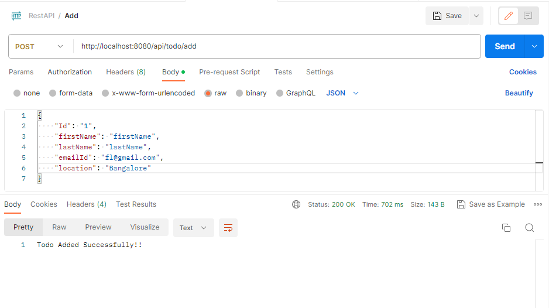
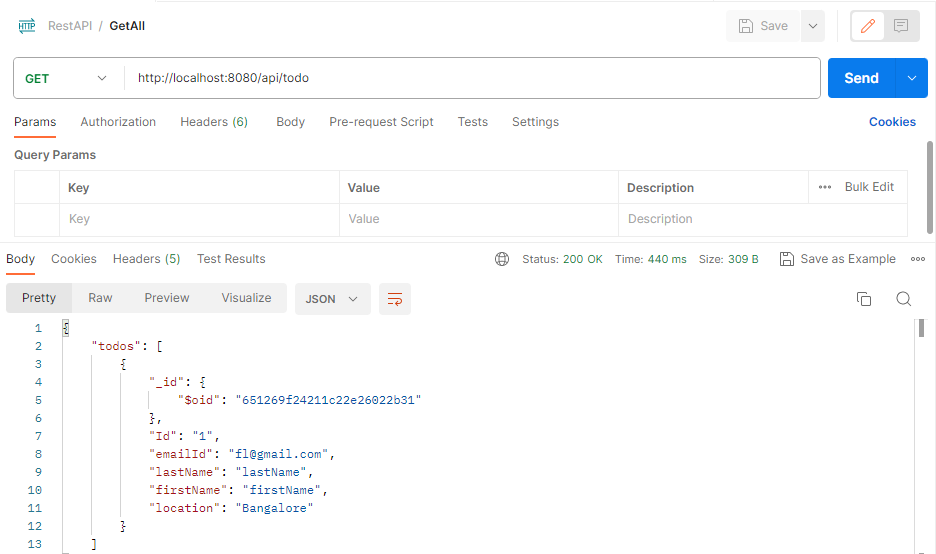

# RestApiCpp

RestApplication using crow framework

## Table of Contents

* [**Prerequisites**](#prerequisites)
* [**Setup MongoDB database**](#setup-mongodb-database)
* [**Download MongoDB C/C++ drivers**](#download-mongodb-c/c++-drivers)
* [**CMake**](#cmake)
* [**Setup build via CMake**](#setup-build-via-cmake)
* [**Execute build via CMake**](#execute-build-via-cmake)
* [**Boost Framework**](#boost-framework)
* [**Crow Framework**](#crow-framework)
* [**Install and setup CROW via vcpkg**](#install-and-setup-crow-using-vcpkg)
* [**Create from scratch**](#create-from-scratch)

### **Prerequisites**

Make sure you have installed all of the following prerequisites on your development machine :

* **Visual Studio 2022** - Download & install Desktop development with C++ workload.

* **MongoDB Atlas account** - Create a MongoDB Atlas account with a cluster. It provides an easy way to host and manage your data in the cloud.

* **CMake** - Download MSI x64 installer and install CMake. Make sure to add CMake to the system PATH for all users.

* **Git** - Download and install Git for Windows to clone the vcpkg repo.

* **Postman** - A comprehensive tool for API development, testing, and collaboration. Useful for testing and interacting with APIs, ensuring they function correctly. 

### **Setup MongoDB database**

**1. Sign in to MongoDB Atlas**

* If you already have a MongoDB Atlas account, navigate to the [MongoDB Atlas login page](https://account.mongodb.com/account/login) and enter your credentials.
* If you don't have an account, you'll need to create one. Click on "Register" and provide the required details.

**2. Choose the Free Version**

* After logging in (or signing up and logging in), you'll be presented with an option to build a new cluster. Choose the "Free" tier, which is known as the M0 Sandbox tier. This tier will provide you with 512 MB of storage and is suitable for small-scale development.
* Choose the cloud provider and region that's most suitable for you. Some options might be grayed out, as they're not available for the free tier.

**3. Setup Cluster**

* Once you've chosen the free version, MongoDB Atlas will begin setting up your cluster. This process may take a few minutes.

**4. Access the Cluster's Dashboard**

* After the cluster is set up, click on the cluster's name to go to its dashboard.

**5. Create Database & Collection**

* From the cluster's dashboard, click on the "Collections" button.
* Then, click on the "Create Database" button.
* Name the database "TodoRecords".
* Immediately create a new collection within this database named "TodoCollection".

**6. Create Database User**

* In the left sidebar of MongoDB Atlas, under the "Security" section, select "Database Access".
* Click on the "Add New Database User" button.
* Fill in the desired username and password for this user. Be sure to note this password, as you will need it later.
* Assign the required roles for this user, such as "readWriteAnyDatabase" if you want this user to have read and write permissions for any database.

**7. Update the URI with Password**

* Go back to the cluster's dashboard and click on the "CONNECT" button.
* Choose "Connect your application".
* Select the C++ driver and the latest version.
* You'll be given a connection string (URI). Replace <password> in this URI with the password of the user you just created.

### **Download MongoDB C/C++ drivers**

The MongoDB C and C++ drivers are essential software libraries that facilitate the interaction between applications written in C/C++ and a MongoDB server. Here are the reasons why we use these drivers:

* **Native Interaction**: The drivers allow your C or C++ application to communicate natively with a MongoDB database. Without them, your application would not be able to understand or interact with MongoDB directly.

* **Efficiency**: The drivers are optimized for performance, ensuring that operations executed against a MongoDB database from a C or C++ application are executed as quickly and efficiently as possible.

* **Feature Support**: MongoDB has a variety of features, from basic CRUD operations to more advanced queries, aggregations, and transactions. The drivers provide support for these features, enabling your application to fully utilize the capabilities of MongoDB.

* **Type Mapping**: MongoDB uses BSON (Binary JSON) as its data format. The drivers handle the conversion between C/C++ native types and BSON, abstracting the complexity from the developer.

* **Connection Management**: Establishing a stable connection, handling reconnections, and managing connection pooling are critical for interacting with a database. The drivers manage these aspects, ensuring a stable connection to the MongoDB server.

* **Error Handling**: When an error or exception occurs, such as a failed query or a connection drop, the drivers provide mechanisms to capture, interpret, and handle these situations gracefully.

* **Consistency with MongoDB Evolution**: MongoDB is actively developed, with new features, optimizations, and changes in each release. The official drivers are updated in tandem with the database's evolution, ensuring compatibility and support for new features.

* **Platform Integration**: The drivers can be integrated into various platforms, systems, or frameworks that support C or C++ development, making it versatile for various applications.

* **Community and Official Support**: Using the official drivers means you benefit from both MongoDB Inc's official support and the broader community's expertise. This is invaluable for troubleshooting, seeking best practices, or understanding new features.

**1. Download the Drivers:**

**C Driver:**

* Navigate to the official [MongoDB C Driver releases page](https://github.com/mongodb/mongo-c-driver/releases).
* Locate the version you want, for example, 1.24.4.
* Download the corresponding tarball (.tar.gz) file.

**C++ Driver:**

* Go to the official [MongoDB C++ Driver releases page](https://github.com/mongodb/mongo-cxx-driver/releases).
* Find the version you're interested in, such as r3.7.0.
* Download the tarball (.tar.gz) file.

**2. Extract the Drivers**

* For the C driver: Extract it to the directory C:\mongo-c-driver-1.24.4.
* For the C++ driver: Extract it to C:\mongo-cxx-driver-r3.7.0.

### **CMake**

CMake is an `open-source`, `cross-platform` family of tools designed to build, test, and package software. It controls the software compilation process using simple, platform- and compiler-independent configuration files. CMake generates native makefiles and workspaces tailored for the compiler environment of the user's choice.

**Why we need CMake:**

* **Cross-Platform Compatibility**: One of the primary reasons for using CMake is its ability to work across different platforms, from Windows to macOS to various flavors of Linux and more. Write once, compile anywhere.

* **Out-of-Source Builds**: CMake supports building projects outside of the source directory. This keeps build artifacts separate from the source code, maintaining a clean project directory.

* **Generates Native Build Systems**: CMake isn't a compiler or a direct build system. Instead, it generates files for various build systems, such as UNIX Makefiles, Visual Studio project files, Xcode projects, and more. This flexibility allows developers to use their preferred tools.

* **Modularity and Scripting**: CMakeLists.txt files can be arranged in a hierarchical manner, making it possible to manage even large-scale projects with multiple subcomponents. CMake's scripting capabilities also allow for advanced configurations and build processes.

* **Customizable Build Configurations**: With CMake, developers can easily set up different build configurations, like Debug, Release, or RelWithDebInfo, tailoring the build process to different needs.

* **Find Packages Easily**: CMake includes a mechanism to find libraries and packages that are installed on a system, making it simpler to include and link against them. This reduces the hassle of manually setting include paths and library paths.

* **Toolchain Files for Cross-Compilation**: CMake supports cross-compilation through the use of toolchain files. These files define the tools (compilers, linkers, etc.) to be used, making it easier to compile software for different targets from a single machine.

* **Continuous Integration & Testing**: With the help of the CTest tool bundled with CMake, it's easier to integrate testing directly into the build process, facilitating continuous integration workflows.

* **Community and Ecosystem**: Given its popularity, there's a strong community around CMake, offering modules, scripts, and tools that extend its functionality.

### **Setup build via CMake**

`CMake` is a cross-platform, open-source tool designed to build, test, and package software. It controls the software compilation process using platform-independent configuration files and generates native makefiles and workspaces that can be used in the compiler environment of your choice.

**1. Configuration & Generation:**

* **Purpose**: This step is about telling CMake how the project should be built. It's where you specify your desired configurations, toolchain, platforms, and more.
* **Outcome**: CMake will generate build files tailored for the specified build system (in this case, "Visual Studio 17 2022"). This can be solution files, project files, Makefiles, etc., depending on the generator.

**2. Platform Abstraction:** 

* CMake is a cross-platform tool. This means you can use the same CMakeLists.txt files to generate build configurations for various platforms (Windows, macOS, Linux) and compilers. This greatly simplifies the process of compiling the same codebase across different environments.

**3. Dependencies & Flags:**

* C++ driver dependencies on the C driver: The MongoDB C++ driver is built on top of the C driver. Specifying paths and configurations ensures the C++ driver knows where to find the C driver's headers and compiled libraries.
* Compiler Flags: Flags like -DCMAKE_CXX_STANDARD=17 ensure that the code is compiled with the desired C++ standard, ensuring compatibility and utilization of the latest language features.

**4. Setup build**

* **C driver** - Navigate to `C:\mongo-c-driver-1.23.0\build` and run the below command using CMake in powershell/terminal as an administrator :

```powershell
cmake -G "Visual Studio 17 2022" -A x64 -S "C:\mongo-c-driver-1.24.4" -B "C:\mongo-c-driver-1.24.4\build"
```

* **C++ driver** - Navigate to `C:\mongo-cxx-driver-r3.7.0\build` and run the below command via CMake in powershell/terminal as an administrator :

```powershell
cmake .. -G "Visual Studio 17 2022" -A x64 -DCMAKE_CXX_STANDARD=17 -DCMAKE_CXX_FLAGS="/Zc:__cplusplus /EHsc"-DCMAKE_PREFIX_PATH=C:\PROGRA~1\mongo-c-driver -DCMAKE_INSTALL_PREFIX=C:\PROGRA~1\mongo-cxx-driver
```

### **Execute build via CMake**

**1. Compilation:**

* Purpose: This is the step where source code gets compiled. The generated build files from the setup phase tell the compiler what to do.
* Outcome: The end result is compiled binaries (like .lib or .a files for static libraries, and .dll or .so files for dynamic libraries).

**2. Error Detection:** 

* During the build process, any issues in the code (syntax errors, unresolved references, etc.) will be flagged, allowing the developer to correct them.

**Optimization & Debug Information:** 

* Flags such as --config RelWithDebInfo instruct the compiler to build the code with optimizations suitable for release but also with debug information. This allows for efficient execution while retaining the ability to debug if necessary.

**4. Installation:**

* Purpose: The --target install command tells the build system to not only compile the code but also to place the compiled binaries, headers, and other necessary files into specified directories (e.g., system directories or custom paths). This makes them easily accessible for other projects and tools.
* Outcome: Headers, libraries, and other essential files are placed in a structured directory layout, ready for use by other applications or libraries.

**5. Execute build**

* **C driver** - Under `C:\Repos\mongo-c-driver-1.23.0\build` run the below command in powershell/terminal as an administrator to build and install the driver :

```powershell
cmake --build . --config RelWithDebInfo --target install
```

* **C++ driver** - Under `C:\Repos\mongo-cxx-driver-r3.7.0\build` run the below command in powershell/terminal as an administrator to build and install the driver :

```powershell
cmake --build . --target install
```

### **Boost Framework**

Boost C++ Libraries, often referred to simply as Boost, is a collection of peer-reviewed, portable, and high-quality libraries that augment and complement the C++ Standard Library. These libraries facilitate tasks ranging from low-level programming chores to high-level, domain-specific operations.

**Why we need Boost:**

* **Filling Gaps**: Boost provides functionalities that might be missing from the C++ Standard Library, offering a more comprehensive set of tools for developers.

* **Rapid Prototyping**: Given its wide range of utilities and algorithms, Boost can speed up the development process, allowing for faster prototyping and development.

* **High Quality**: Boost libraries undergo rigorous peer review, ensuring they meet high standards of design, performance, and reliability.

* **Portability**: Boost is designed to be cross-platform and works across various compilers, ensuring that code written using Boost libraries remains portable.

* **Influence on C++ Standard**: Many features originally developed in Boost have made their way into the C++ Standard Library. Using Boost can, in a way, provide developers with a glimpse into future C++ standards and practices.

* **Advanced Features**: Boost offers advanced libraries for tasks like asynchronous I/O (Boost.Asio), multi-threading, and even metaprogramming, which can significantly enhance a C++ application's capabilities.

* **Consistency**: By providing a consistent interface across its libraries, Boost makes it easier for developers to learn and use different parts of the collection.

### **Crow Framework**

Crow is a fast, lightweight, and easy-to-use C++ micro web framework (similar in spirit to Flask for Python or Sinatra for Ruby). It's designed for creating web services with a minimal amount of code and overhead. Here are some of the characteristics and features of Crow:

* **Header-only**: Crow is primarily distributed as a header-only library, which means you don't need to compile it separately; including the header files in your project is typically sufficient.

* **Fast**: Crow is optimized for performance and can handle a large number of requests with minimal overhead.

* **Simple to Use**: With Crow, setting up a basic web server can be done with just a few lines of code.

* **Middleware Support**: Crow allows you to use middleware components that can process requests or modify responses. This is useful for functionalities like logging, error handling, or authentication.

* **JSON Support**: Crow has built-in support for JSON, making it easy to create RESTful APIs.

* **WebSockets**: Crow also has basic support for WebSockets, enabling real-time communication between the server and the client.

* **Route-based Request Handling**: Define handlers for specific routes and HTTP methods. For example, you can easily set up a handler to process GET requests for a specific URL path.

<br>

`Crow` is built on top of the `Boost` libraries, particularly the Boost.Asio library. Here's how Crow is interconnected with Boost:

* **Boost.Asio for Networking:** Boost.Asio provides a scalable and efficient asynchronous I/O framework that's suitable for building network applications. Crow uses Boost.Asio to handle all the low-level networking tasks, such as managing sockets, handling incoming connections, and processing HTTP requests asynchronously. By leveraging Boost.Asio, Crow can handle multiple concurrent connections with efficient use of resources.

* **Boost for Multi-threading:** Crow uses Boost's threading libraries to manage threads in its server. This allows Crow to handle multiple requests concurrently, improving the throughput of the server.

* **Boost for Utilities:** Crow also takes advantage of various other Boost utilities and data structures to manage its internal workings. This includes things like containers, algorithms, and smart pointers.

* **Headers and Dependencies:** Because Crow is built on Boost, if you inspect Crow's header files, you'll often see Boost headers being included and Boost types being used throughout the code.

* **Maturity and Stability:** By building on top of Boost, Crow can benefit from the maturity, stability, and performance of Boost libraries. Boost is one of the most widely used C++ libraries, with a long history of rigorous testing and development.

### **Install and setup Crow using vcpkg**

**1. Clone the vcpkg repo :**

```bash
git clone https://github.com/Microsoft/vcpkg.git
```

**2. Run the bootstrap script in powershell/terminal as an administrator to build vcpkg :**

```powershell
.\vcpkg\bootstrap-vcpkg.bat
```

**3. Install Crow libraries for the project :**

```powershell
vcpkg install crow
```

**4. Link vcpkg with existing installation of Visual Studio 2022 :**

```powershell
vcpkg integrate install
```

### **Create from scratch**

**1.** Create a new project in Visual Studio with template `Console App`.

**2.** Configure your new project with project name `restapicpp`.

**3.** Open project properties. On the dialog box that appears, in the Configuration Properties, set C/C++ as follows :

* **General** - add Additional Include Directories 

```markdown
C:\mongo-cxx-driver\include\mongocxx\v_noabi;C:\mongo-cxx-driver\include\bsoncxx\v_noabi;C:\mongo-c-driver\include\libmongoc-1.0;C:\mongo-c-driver\include\libbson-1.0;%(AdditionalIncludeDirectories)
```


* **Language** - change the C++ Language Standard to C++17.

* **Command Line** - add `/Zc:__cplusplus` in the Additional Options field.

**4.** In the Configuration Properties, go to linker input and add the driver libs in Additional Dependencies section

```markdown
"C:\Program Files\mongo-c-driver\lib\bson-1.0.lib";"C:\Program Files\mongo-c-driver\lib\mongoc-1.0.lib";"C:\Program Files\mongo-cxx-driver\lib\bsoncxx.lib";"C:\Program Files\mongo-cxx-driver\lib\mongocxx.lib";%(AdditionalDependencies)
```

**5.** In the Configuration Properties, go to Debugging and add Environment path to the driver executables - 

`PATH=C:\mongo-c-driver\bin;C:\mongo-cxx-driver\bin`.

**6.** Apply changes to the dialog.

**7.** Add `restapicpp.cpp` to project.

```c
#include "Methods.h"

// ********************************************** Main **********************************************
int main()
{
	crow::SimpleApp app; //define your crow application
	set_global_base("."); //search for the files in current dir.
	mongocxx::instance inst{};
	string mongoConnect = std::string("your-mongodb-uri");
	mongocxx::client conn{ mongocxx::uri{mongoConnect} };
	auto collection = conn["TodoRecords"]["TodoCollection"];//get collection from database

	//API endpoint to read all todos
	CROW_ROUTE(app, "/api/todo")
		([&collection](const request& req) {
		mongocxx::options::find opts;
		auto docs = collection.find({}, opts);
		vector<crow::json::rvalue> todo;

		for (auto doc : docs) {
			todo.push_back(json::load(bsoncxx::to_json(doc)));
		}
		crow::json::wvalue dto;
		dto["todos"] = todo;
		return crow::response{ dto };
			});

	//API endpoint to insert todo from the given json body
	CROW_ROUTE(app, "/api/todo/add").methods(HTTPMethod::POST)
		([&collection](const request& req) {
		crow::json::rvalue request_body = json::load(req.body);

		// List of required keys
		std::vector<std::string> required_keys = { "Id", "firstName", "lastName", "emailId", "location" };

		// Check if all required keys exist in the request body
		for (const auto& key : required_keys) {
			if (!request_body.has(key)) {
				return crow::response(400, "Required key '" + key + "' missing in request body");
			}
		}

		// Check if the ID is already in the database
		bool id_already_present = findTodoRecord(collection, std::string(request_body["Id"]));

		if (!id_already_present) {
			// ID is not present, so insert the new record
			insertTodo(collection, createTodo({
				{"Id", std::string(request_body["Id"])},
				{"firstName", std::string(request_body["firstName"])},
				{"lastName", std::string(request_body["lastName"])},
				{"emailId", std::string(request_body["emailId"])},
				{"location", std::string(request_body["location"])},
				}));
			return crow::response(200, "Todo Added Successfully!!");
		}
		else {
			// ID is already present
			return crow::response(400, "ID already present in the database");
		}
			});

	//set the port, set the app to run on multiple threads, and run the app
	app.bindaddr("127.0.0.1").port(8080).multithreaded().run();

}
```

**8.** Add header file to the project,i.e `Methods.h`.

```c
#pragma once
#include <mongocxx/client.hpp>
#include <bsoncxx/builder/stream/document.hpp>
#include <bsoncxx/json.hpp>
#include <mongocxx/uri.hpp>
#include <mongocxx/instance.hpp>
#include <algorithm>
#include <iostream>
#include <vector>
#include "crow.h"
using namespace std;
using namespace crow;
using namespace crow::mustache;
using bsoncxx::builder::basic::kvp;
using bsoncxx::builder::basic::make_document;

// Create a todo from the given key-value pairs.
bsoncxx::document::value createTodo(const vector<pair<string, string>>& keyValues)
{
	bsoncxx::builder::stream::document document{};
	for (auto& keyValue : keyValues)
	{
		document << keyValue.first << keyValue.second;
	}
	return document << bsoncxx::builder::stream::finalize;
}

// Add the todo to the given collection.
void insertTodo(mongocxx::collection& collection, const bsoncxx::document::value& document)
{
	collection.insert_one(document.view());
}

// Find a todo from the given key-value pairs and return true if found.
bool findTodo(mongocxx::collection& collection, const string& key, const string& value)
{
	// Create the query filter
	auto filter = bsoncxx::builder::stream::document{} << key << value << bsoncxx::builder::stream::finalize;
	//Add query filter argument in find
	auto cursor = collection.find({ filter });
	auto count = std::distance(cursor.begin(), cursor.end());
	if (count != 0L) {
		return true;
	}
	return false;
}

//Pass the given collection and key-value pairs.
bool findTodoRecord(mongocxx::collection& collection, const string& id)
{
	return findTodo(collection, "Id", id);
}
```

**9.** Now debug/run the project to view the final build.

### Endpoints through Postman

* Add Method `http://localhost:8080/api/todo/add`



* GetAll Method `http://localhost:8080/api/todo`

